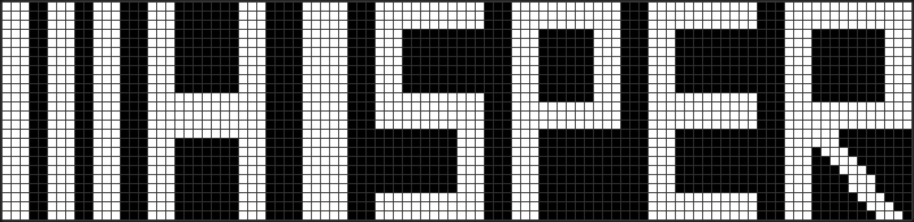

  

# Whisper

> Off-grid messaging for everyone. No internet, no cell towers, no limits.

## What is Whisper?

A beautiful, easy-to-use operating system for LoRa mesh radios. Send messages, share your location, and stay connected even when the grid goes down.

## ✨ Features

- 📱 **Send Messages** - Chat with anyone on the mesh network
- 🌏 **Full Language Support** - Chinese, Japanese, Korean, and more
- 📍 **GPS Tracking** - Share your location with friends
- ⌨️ **Easy Typing** - Built-in keyboard on your device
- 🔋 **Long Battery Life** - Runs for days on a single charge

## 📥 Download

Get the latest firmware from our [releases page](https://github.com/csrutil/whisper-dev/releases).

## 📱 Supported Devices

| Device | Notes |
|--------|-------|
| Heltec V3, V4, T114 | Full support |
| GAT562 Mesh Watch | Full support |
| GAT562 Trial Tracker | Full support |
| Wio Tracker L1 | Full support |
| MeshTiny | Full support |

## The Fine Print 📝

- **Testing firmware only**: These builds are for testing and experimentation. Please test thoroughly before relying on them in critical situations
- **Backup your data**: Always backup your device configuration and data before installing
- **No warranty**: Provided as-is without guarantees. We recommend testing in your specific environment
- **Use responsibly**: Please ensure your use complies with local regulations. Users are responsible for their own compliance

## 🌐 Powered by MeshCore

[Learn more about MeshCore](https://github.com/meshcore-dev/MeshCore)
